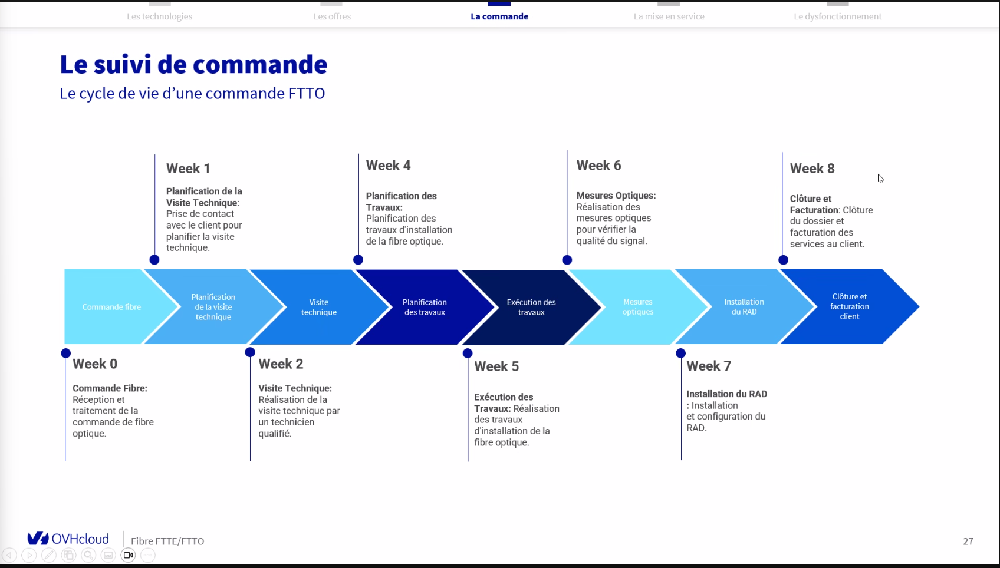
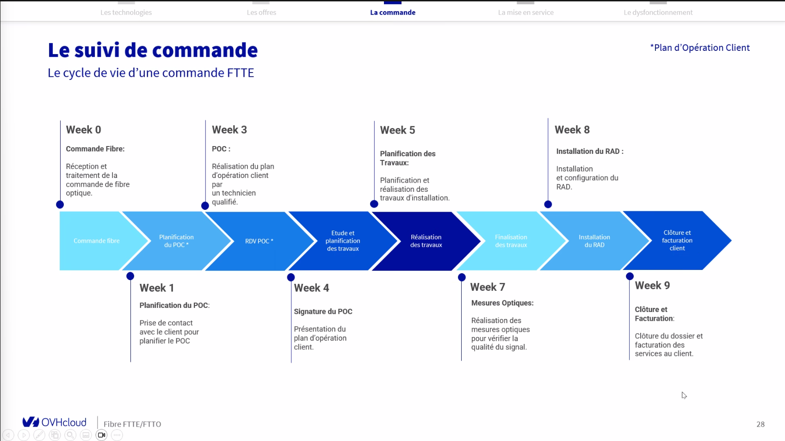
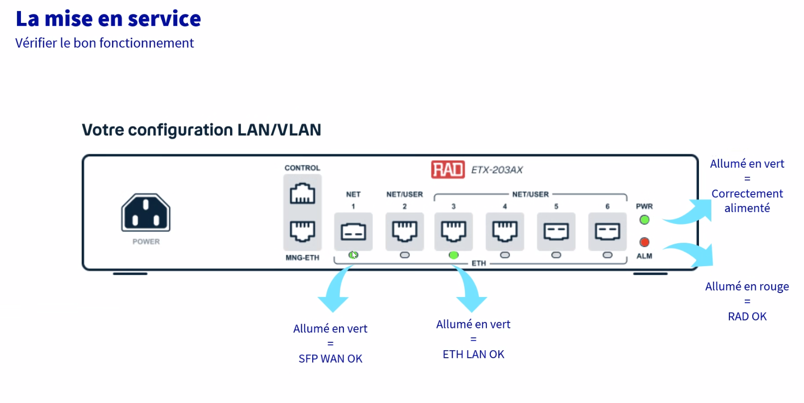
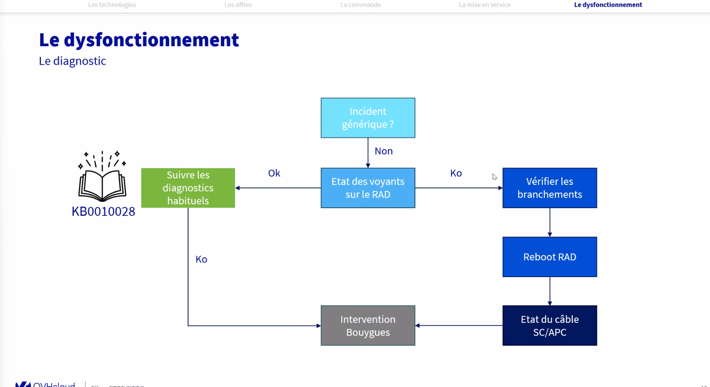
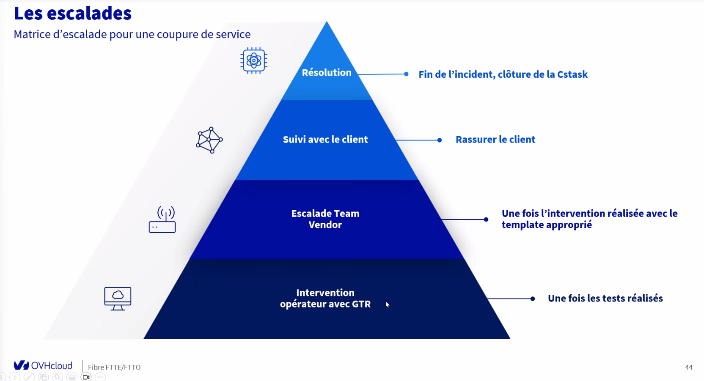
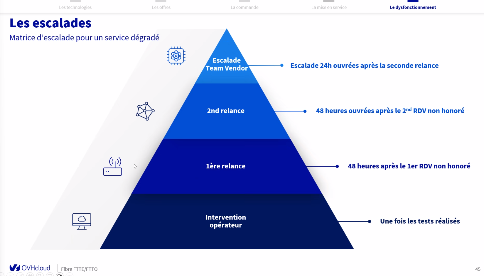

FTTO / FTTE

FTTE > Pas 100% dédié > Basé sur l'infra FTTH existante 
s'appuie sur l'infra FTTH existante du NRO au PM
Fibre dédié du PM au client
Débit garanti et symétrique
GTR 4HO incluse

FTTE plaque :

NRO > PM > PRE (Point de raccordement Entreprise) > Client (PTO ou Bandeau Optique) > RAD > Routeur

PRE peut être intérieur ou extérieur
Bandeau Optique raccordé directement au SFP

***
FTTO > Infra dédie / Fibre dédiée
Débit garanti et symétrique 
GTR 4HO incluse

FTTO plaque :

NRO > Fibre dédiée >  PRE (Point de raccordement Entreprise) > Client (PTO ou Bandeau Optique) > RAD > Routeur

***
Nouveaux équipements :
Bandeau optique > contient les ports SFP
- a le meme role que la PTO
- Necessite une baie
- Prend 1U à 2U libre sur la baie

RAD > est une marque 
Équivalent à L'ONT
le tech vient avec le RAD lors de l'Installation

Raccordement en Ethernet ou en SFP possible sur routeur perso
Si changement de raccordement > Ticket RUN nécessaire car changement de config à envoyer sur le RAD

---------

Offre FTTO/E > Pas possible de migrer d'un débit à l'autre côté client 
mais ce sera possible en interne via ticket

50% de réduction sur les 6 premiers mois

***
Suivi de commande FTTO:
Délai moyen 8 semaines

Suivi de commande FTTE:
POC > Plan Operation Client
Délai moyen 9 semaines

****

Annuler / Escalader / Relancer > Team vendor > Pas possible sur adviser
Utiliser les template dispo et une ctask

****
Mise en service 
Branchements :

- Vérifier si alimenter
- Port SFP / Net 1
- Routeur en ethernet / User (Port 3 ou 4)
- Port SFP dispo si client veut raccorder le RAD à son routeur en SFP
Voyants :
- PWR > Vert == alimenté correctement
- ALM == allumé en rouge > RAD OK

***
DIAG 

***
Escalades :

service dégradé :
