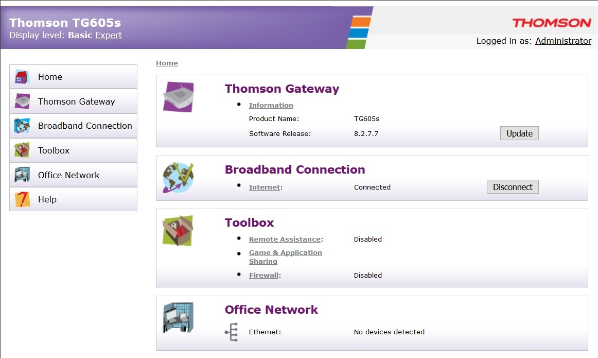
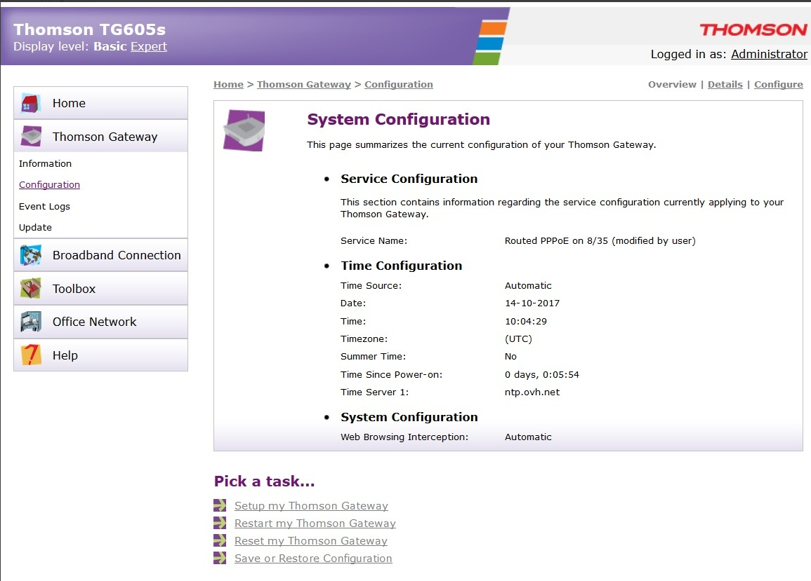
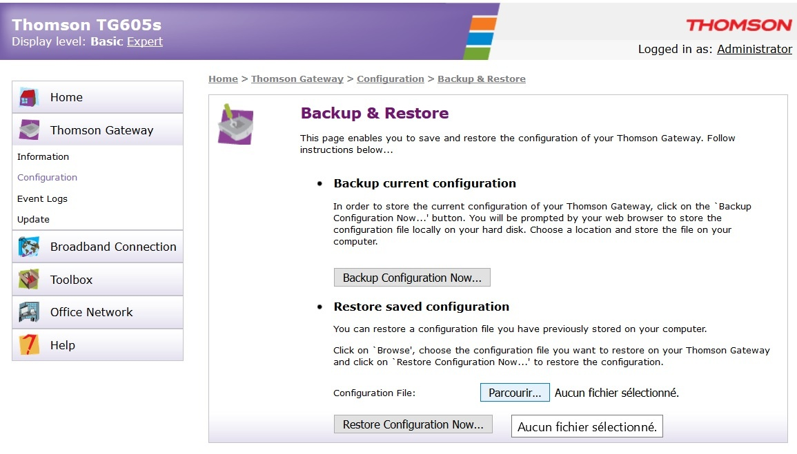
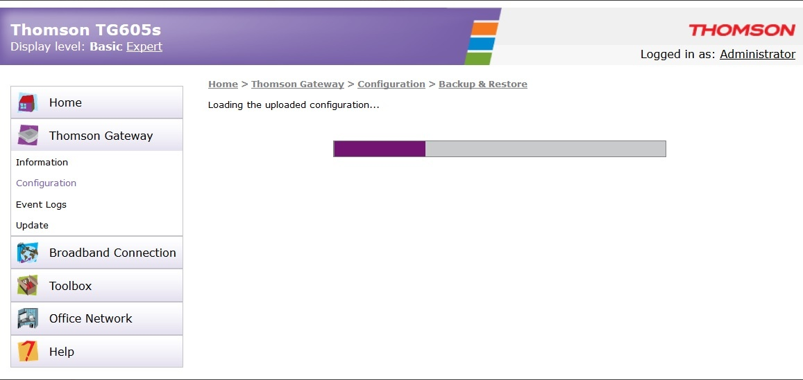

### Configuration du modem en Bridge depuis son interface
Source : https://confluence.ovhcloud.tools/pages/viewpage.action?pageId=95134573
***
>A savoir

>Afin d'obtenir un mode bridge optimal, il est conseillé d'avoir le modem en configuration neutre. N'hésitez pas à effectuer un reset de celui-ci et ensuite d'appliquer la configuration ci-dessous.
****

- Brancher un ordinateur directement sur le modem en ethernet et connectez-vous à l'administration du modem en saisissant sa passerelle dans un navigateur Internet (par défaut [http://192.168.1.254)](http://192.168.1.254%29)
- Vous accédez à l'interface **"Thomson Gateway"** (Cf. ci-dessous)

- Dans le menu latéral, cliquez sur **"Thomson Gateway"** puis **"configuration"**
- En page de la page principale cliquez sur le lien **"Save or Restore Configuration"** (Cf. ci-dessous)  

- Dans la partie "Restore saved configuration" charger le fichier \*.ini que vous avez téléchargé puis cliquez sur "**Restore Configuration Now...**"  

- Après une validation de votre demande, une barre de loading vous indiquera l'avancement du chargement de configuration  

- Une fois le modem redémarré, celui-ci sera en mode Bridge sera effectif. N'ayant pas de ports WAN dédié, l'un des quatre ports peut être utilisé pour port WAN.