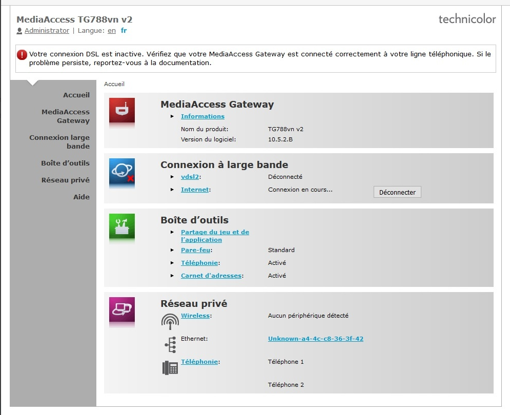
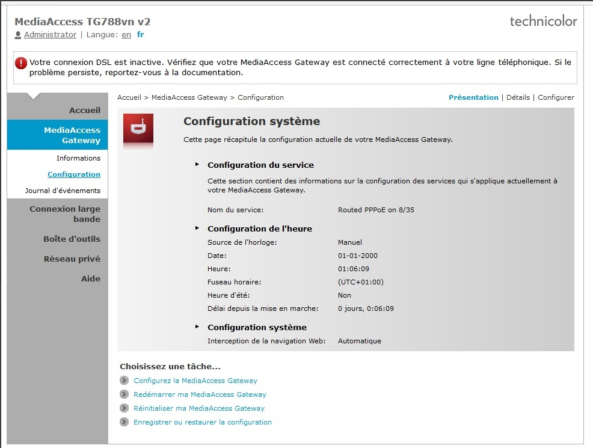
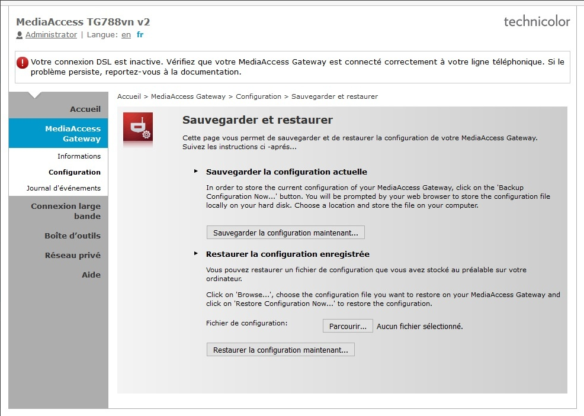
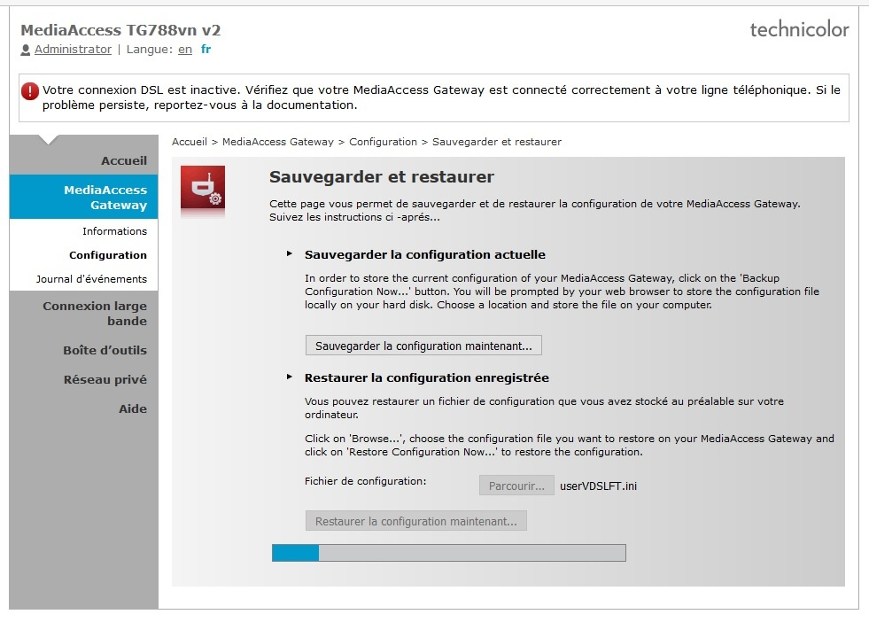

# Quelle est la question du client ?

* * *
Le client souhaite passer son modem TG 788v1 ou v2 ou TG789 en mode bridge, le modem est contrôlé en local.

# Point à vérifier au préalable
Il vous faut connaître la référence du modem ainsi que la collecte de l'accès. Il faudra également indiquer au client que toute configuration effectuée sur le modem sera perdue.

# Détails de la configuration  
Les versions du modem Technicolor TG788 v1 et v2 ainsi que le TG789 peuvent être configuré en modem Bridge (Mode Pont) selon deux méthodes que préconise OVH :

- Par le biais de l'importation d'un fichier de configuration dédié.
- Depuis l'espace client et le contrôle à distance du modem. 

>Important

>La configuration par le "wizard" d'installation constructeur ne permets pas un mode bridge fonctionnel avec nos équipements. 

### Connexion à l'interface modem

*Les interfaces admin des trois références étant identiques, la configuration ci-dessous a été effectuée sur un modem TG788v2.*

- Connectez un ordinateur en Ethernet directement sur le modem, et demander à votre de saisir l'adresse de la passerelle de celui-ci (par défaut [http://192.168.1.254)](http://192.168.1.254%29/) dans un navigateur, vous accéderez à l'administration du modem (Cf. ci-dessous)

- Dans le menu de gauche cliquez sur la rubrique **"Media Access Gateway"**, puis la sous-rubrique **"Configuration"**

 

- **En bas de la page, cliquez sur lien textuel **"Enregistrer ou restaurer une configuration"****

- **Une fois le fichier de configuration sélectionné, cliquez sur **"Restaurer la configuration maintenant..."** (Cf. ci-dessous)  
    **Une validation sera demandée pour lancer la procédure.  
    La barre de loading vous indique l'avancement du chargement du fichier de configuration.

**Suite au redémarrage du modem, celui sera en mode Bridge. Les deux références ne possédant pas de ports Wan, les 4 ports Ethernet permettant de transmettre le flux réseau en sortie.**