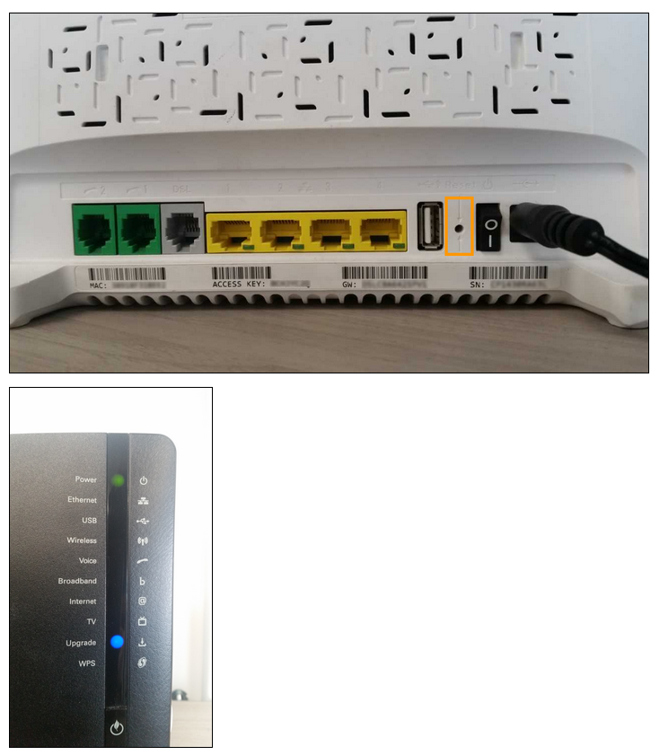

## TG788

#### Bridge

Bonjour Monsieur,

Comme convenu lors de notre échange téléphonique, je vous envoie la procédure afin d'activer le mode bridge sur l'interface locale du modem.

Veuillez cliquer sur le lien ci-dessous pour télécharger le fichier de configuration mode bridge.

Lien: http://files.isp.ovh.net/tg788v2/bridge/

Ensuite, vous devez insérer ce fichier dans le modem directement en suivant la procédure ci-dessous.

1 - Enregistrez le fichier "userVDSLFTBridgeRelay.ini" grâce à un clique droit puis "Enregistrer la cible du lien sous..."
2 - Rendez vous sur l'interface locale du modem via ce lien http://192.168.1.254
3 - Cliquez sur "Media Access Gateway" ou "Technicolor Gateway"
4 - Cliquez sur "Configuration" dans le menu déroulant
5 - Cliquez sur "Enregistrer ou Restaurer la configuration"
6 - Cliquez sur "Restaurer avec un fichier de configuration"
7 - Sélectionnez le fichier "userVDSLFTBridgeRelay.ini"
8 - Cliquez sur "Restaurer"
9 - Le modem redémarre une fois la barre de chargement terminée.

Le modem est en bridge, vous devez maintenant établir la session PPPOE sur votre routeur / firewall afin que la connexion s'établisse grâce à vos identifiants de connexion.

#### Reset physique
Souce : https://confluence.ovhcloud.tools/pages/viewpage.action?pageId=95134462
***

- Il faut débrancher tous les câbles RJ45 (ports jaunes sur la photo ci dessous) et ensuite appuyer dans le trou "reset" (avec un trombone ou cure-dent) jusqu'à ce que le voyant "Upgrade" passe en bleu (environ 15 secondes, bien attendre même si les voyants s'éteignent), ensuite vous relâchez.

>Durant la réinitialisation le voyant "Power" sera orange clignotant sur le modem TG788vn V2 et vert sur le TG788vn.

- Le modem va redémarrer plusieurs fois avant d'être pleinement opérationnel (maximum 15 min).

