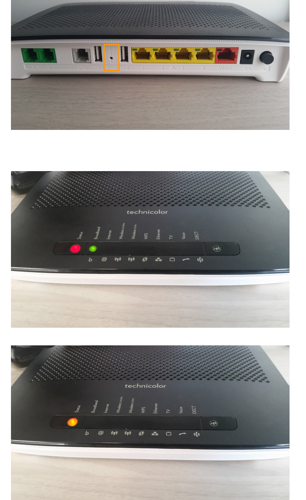
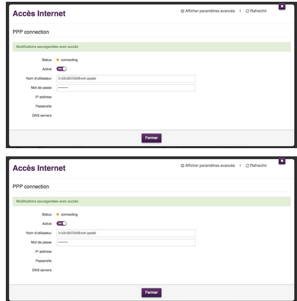
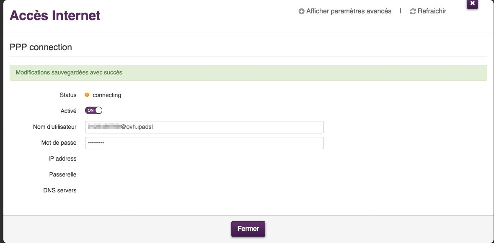

## TG799
Source : https://confluence.ovhcloud.tools/pages/viewpage.action?pageId=95134464
#### Reset physique
- Il faut débrancher tous les câbles RJ45 (ports jaunes sur la photo ci dessous) et ensuite appuyer dans le trou "reset" (avec un trombone ou cure-dent) pendant au moins 15 secondes puis vous relâchez et vous attendez.

- Rien ne se passera, c'est normal, il faudra attendre environ 30 secondes après avoir relâché pour que le modem réagisse.

>Le voyant "Status" passera au rouge ensuite tous les voyants s'allumeront et enfin il sera orange.

- Le modem va redémarrer plusieurs fois avant d'être pleinement opérationnel (maximum 15 min).

****

#### Connexion PPP
- Le modem TG799vac est, par défaut, configuré en config@ovh.ipadsl, et une fois qu'il contacte le TR69, les bonnes informations de connexion sont sensées redescendre.

- Si toutefois tel n'était pas le cas, le client a toujours la possibilité de renseigner lui-même ses identifiants de connexion.

- Pour se faire, il doit se rendre dans l'interface web du modem, et plus précisément dans l'espace "Accès Internet" :

Là, le client doit modifier les 2 champs "Nom d'utilisateur" et "Mot de passe" :

Sauvegarder pour valider le changement d'identifiant.