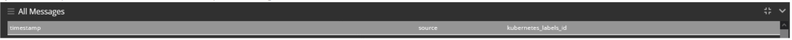
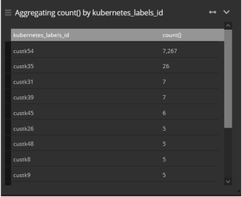

## Graylogs
[FROM_CUSTOMER_TO_CSEDGE]
[FROM_CSEDGE_TO_CUSTOMER]
[PHONENUM_FROM_HEADER_INVALID]
[PHONENUM_FROM_HEADER_FORBIDDEN]
[KEEPALIVE]
[REQINIT]
[FROM_BAN_blacklist]
[PHONENUM] NOT normalized
[LIMIT_CPS]
Invalid number
* * *
## Recherche Graylog :
- Erreur 500 > kubernetes_labels_id:custk54 AND "INCOMING_REPLY" AND "R=500"
- Entete Invalide > kubernetes_labels_id:custk54 AND PHONENUM_FROM_HEADER_INVALID
- Recherche Prefixe > kubernetes_labels_app:cust AND FROM_CUSTOMER_TO_CSEDGE AND message:/972.*/ 
* * *
Ajouter UN tableau pour compter le nombre de client ou de resultat de la requête 
Ajouter le champs "kubernetes_labels_id" dans la rubrique "All Messages"

Developper la colonne "kubernetes_labels_id" et clique sur "Show top Values" 

 
* * *