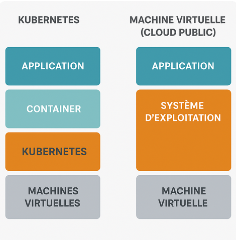

## Différence K8S et VM Public cloud 

La différence entre Kubernetes et une machine virtuelle (VM) dans le cloud public tient à leur niveau d'abstraction, leur finalité et la manière dont ils gèrent les applications. Voici une explication claire et structurée :

## 🧱** 1. Définition de base**
| Concept                    | Description                                                                                                                                                                                                                                                                                |
| -------------------------- | ------------------------------------------------------------------------------------------------------------------------------------------------------------------------------------------------------------------------------------------------------------------------------------------ |
| **Machine virtuelle (VM)** | Une VM est une simulation d’un ordinateur physique, créée via un hyperviseur. Elle inclut un système d’exploitation complet (Linux, Windows, etc.) et vous permet d’installer et de gérer vos applications comme sur un serveur classique.                                                 |
| **Kubernetes**             | Kubernetes est un **orchestrateur de conteneurs** (comme Docker). Il ne remplace pas une VM, mais s'exécute **par-dessus des machines (virtuelles ou physiques)** pour gérer automatiquement le **déploiement, la mise à l'échelle, et la disponibilité** des applications conteneurisées. |

## 🏗️*** 2. Niveau d’abstraction***

VM = Infrastructure

    - Vous gérez tout vous-même : OS, middleware, applications.

    - Comparable à louer un appartement vide.

Kubernetes = Orchestration d’applications

    - Vous gérez uniquement vos conteneurs (ex: microservices).

    - L'infrastructure (VMs, OS) est en arrière-plan.

    - Comparable à avoir un système de gestion automatique de vos colocataires (applications).

## ⚙️** 3. Cas d’usage typique**
| VM                                                                              | Kubernetes                                                                                               |
| ------------------------------------------------------------------------------- | -------------------------------------------------------------------------------------------------------- |
| Héberger une application traditionnelle, un site web, une base de données, etc. | Déployer des microservices, faire du CI/CD, gérer automatiquement les mises à jour, l’auto-scaling, etc. |
| Utilisée pour de petites charges ou des configurations personnalisées           | Utilisée dans des environnements **cloud natifs** et **scalables**                                       |

## ☁️** 4. Dans le cloud public (AWS, Azure, GCP, etc.)**
| Élément     | VM cloud                                    | Kubernetes                                                                                   |
| ----------- | ------------------------------------------- | -------------------------------------------------------------------------------------------- |
| Exemple     | EC2 (AWS), VM (Azure), Compute Engine (GCP) | EKS (AWS), AKS (Azure), GKE (GCP)                                                            |
| Gestion     | Vous gérez les VMs manuellement             | Kubernetes gère les conteneurs automatiquement, vous ne vous occupez plus de la VM en détail |
| Scalabilité | Manuelle (ou via scripts/autoscaling VM)    | Automatique, native à Kubernetes                                                             |

## 🎯** Résumé**
| Critère            | VM                           | Kubernetes                           |
| ------------------ | ---------------------------- | ------------------------------------ |
| OS complet         | Oui                          | Non (fonctionne avec des conteneurs) |
| Niveau             | Infrastructure               | Orchestration applicative            |
| Déploiement rapide | Non                          | Oui                                  |
| Scalabilité native | Limitée                      | Excellente                           |
| Idéal pour         | Applis monolithiques, legacy | Microservices, cloud natif           |

****
