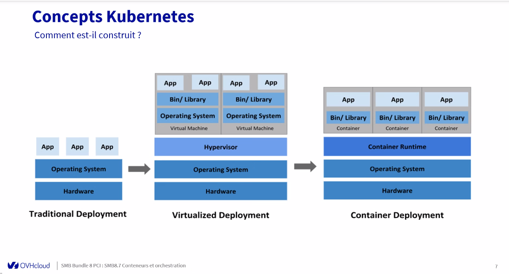
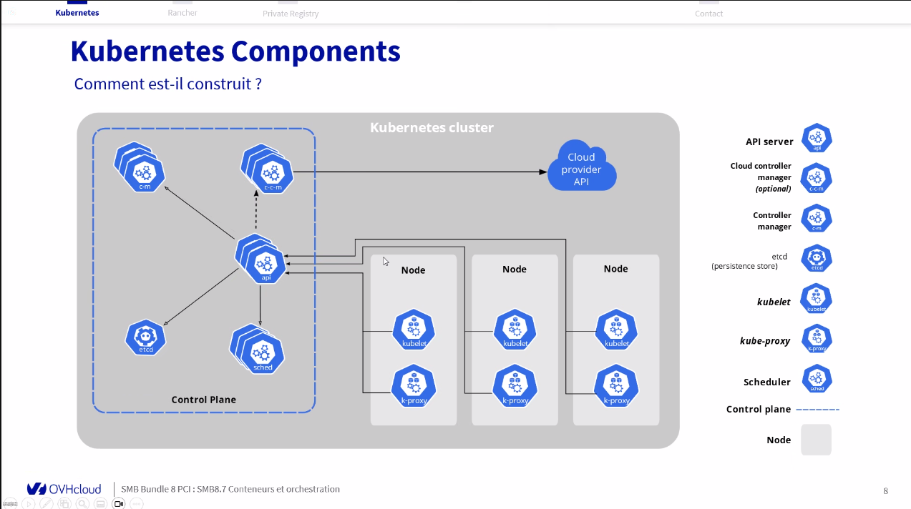
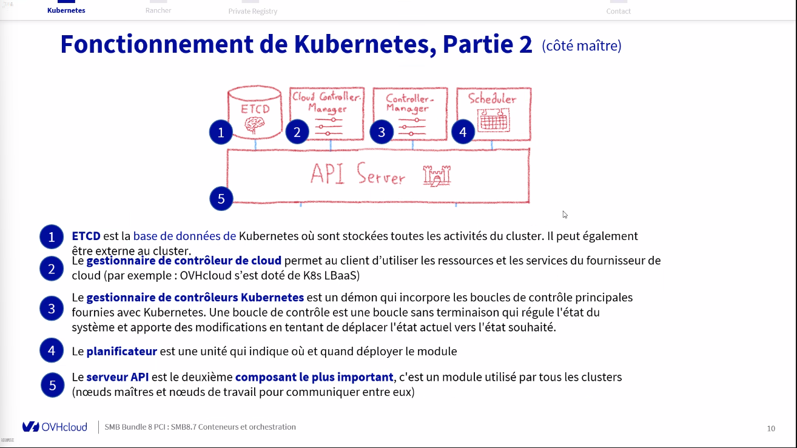
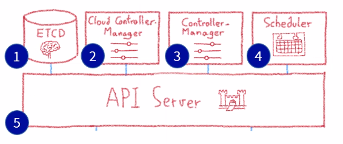
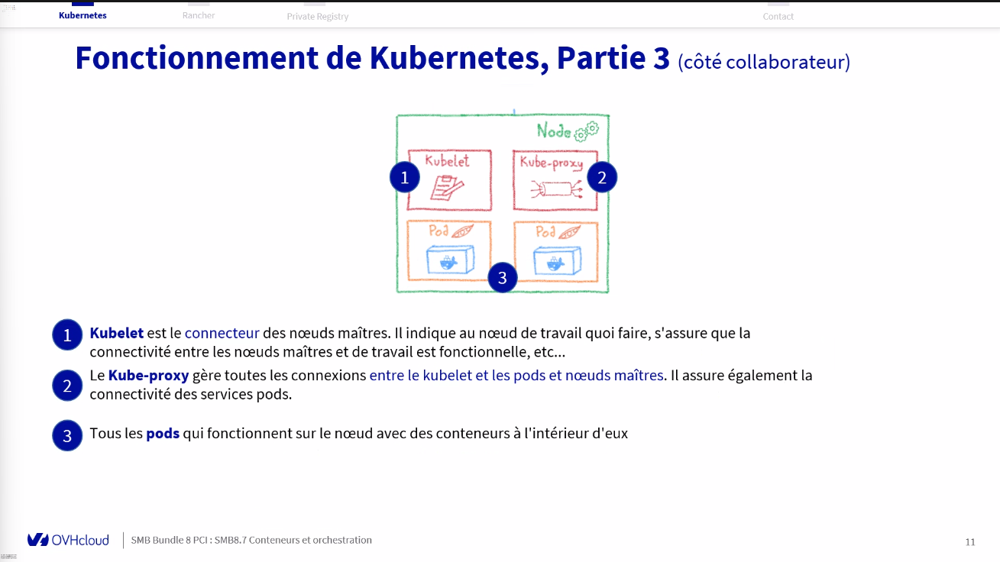
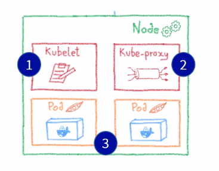
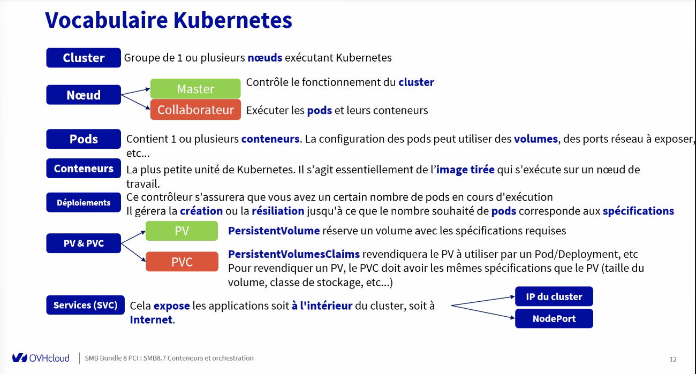
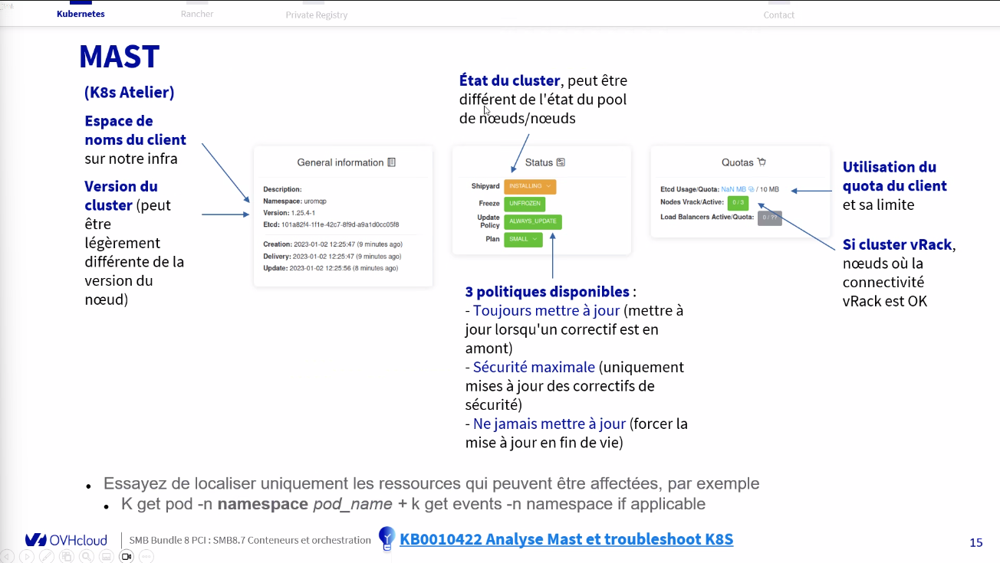
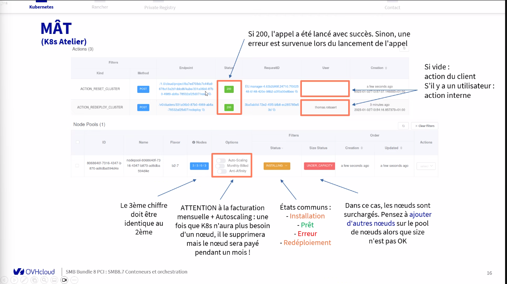

## Kubermetes
Pas payant, tu payes les noeuds qui sont dessus 

##### Manager K8S
SLA 99,5%
> Facilite le déploiement, la mise à l'echelle et la gestion des appli conteneurisées

#### Manager Rancher Service 
>Gérer vos cluster K8S en un seul endroit avec un outils centralisé et géré
Solution de Gestion de conteneur Open Source
>Simplifie le déploiement et la gestion des clusters K8S
> ID Access nécessaire pour se connecter
> Nécessite une IP autorisée pour se connecter
>Attention aux versions et les EOS/EOL
>
>KB0061903 Getting started with managed rancher service
##### Manager private registry 
> Stockez gérez et accédez facilement à vos images de conteneurs et Helm avec ce service entièrement géré.

- interopérabilité totale
> 		> Construit avec solution Open Source comme Docker / port de la CNCF
> 		>

-  sécurité maximale
> 	 	Vulnerability scanning
> 		Replication
- tarification prévisible
- conformité de l'hébergement des données de santé
****

***
#### Qu'est-ce que K8S ?
- Outil d'automatisation du déploiement
- Techno basé sur l'orchestration
- Écrit en Go et Open source
- Anciennement appartenant à google
- Nécessite des certifications pour déployer ce service
****
#### Avantages K8S
- Planification
- Affinité / Anti-Affinité > 
- Santé / Monito > Bcp ticket géré par des robots > OVH gère l'infra auto
- FailOver > Pas de perte d'activité
- Mise à l'échelle > Croissance de l'entreprise
- Réseautage > Compléxité réseau
- Découverte du service > Accompagnement du client
- Catalogue d'Image Docker / Référenciel personnalisé > Compatibilité entre imnage docker et k8s
	- > Le client peut migrer de Docker vers K8S

****
##### Construction K8S

>chroot > Exemple connexion en Rescue > On monte la partition de prod et on change la racine grâce à cette commande
>

>Control manager --> gestion dépendance
>Kube proxy -- >  Sert de répartition de charge
>Node > Client du node master == Exécutant 
>control plane > node master

📦 Cluster Kubernetes
 ├── 🧠 Control Plane
 │     ├── kube-apiserver > Gestion des commandes
 │     ├── scheduler > 
 │     └── controller-manager > 
  |        |___ ETCD > BDD
 └── 💻 Nodes (Nœuds de calcul)
       ├── Node 1 → Pod A, Pod B
       ├── Node 2 → Pod C
       └── Node 3 → Pod D, Pod E

📌 En résumé

Un cluster Kubernetes = Control Plane + Workers (nodes)
→ Il permet d’exécuter, gérer, surveiller, et faire évoluer vos applications conteneurisées de façon centralisée.

****

## Fonctionnement K8S - 1ère partie
K8S utilise un **Framework** de conteneur installé sur les noeuds de travail (workers), plusieurs options : **dockerd**, **containerd**, **cri**
Il est utilisé par K8S pour créer des conteneurs et les gérer
***
Les maitres (Control plane) sont configurés pour gérer le cluster et les noeuds de travail.
Il définit [où les pods peuvent être déployés], gère la com entre les noeuds workers et l'[API server, ETCD, Kube scheduling Service, etc...]
***
## Fonctionnement K8S - 2ème partie

1 -  ETCD == BDD de K8s où sont stockès les activtés du cluster. Peut également être externe au cluster

2 - Gestionnaire de contrôleur de cloud > Permet au client d'utiliser les ressources du fournisseur de cloud (Exemple OVH s'est doté de K8s LBaaS) 

3 - Gestionnaire de contrôleur K8S est un démon qui incorpore les boucles de contrôle principales

4 - 

5 - kube-apiserver > Module utilisé par tous les clusters (Nœud maitre et nœud de travail pour communiquer entre eux)

***
## Fonctionnement K8S - 3ème partie

1 - 
2 - 
3 - 

> Dans le noeud maitre (Control plane) on peut indiquer si un POD tombe, un autre le remplace
>

#### Vocabulaire K8S
Cluster == Groupe de 1 ou plusieurs noeuds exécutant k8s
Un cluster Kubernetes est un ensemble de machines (physiques ou virtuelles) qui travaillent ensemble pour exécuter et gérer des applications conteneurisées.

Noeud == Donner de la ressource - Un node est une machine qui exécute les pods.
>			Master > Contrôle le fonctionnement du cluster
			Collaborateur > Exécuter les pods et leurs conteneurs
Pods == unité de base de déploiement dans Kubernetes. Il contient 1 ou plusieurs conteneurs 
Conteneurs == plus poetite unité d'un k8s
PV > L'emplacement où seront les données
PVC > S'occupe des requêtes de stockage à envoyer au PV

Si il discute avec les node > = Node port
si il discute avec cluster = ip cluster

kube-apiserver > C’est l’unique point d’entrée pour toutes les communications dans le cluster.

****
## MAST
=== k8s Atelier

#### Dépannage 
Cas fréquents :
Check > Analyse Mast et troubleshoot K8S - Outils et processus de dépannage
KB0010422
****

